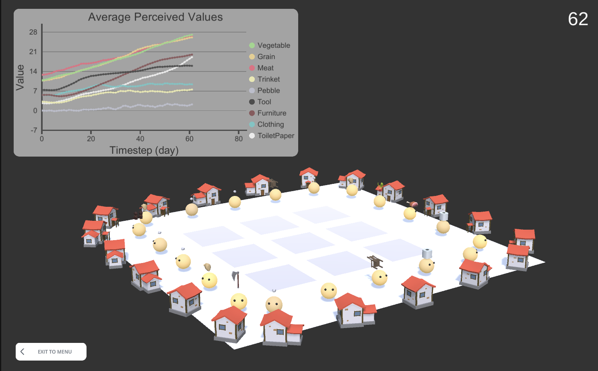

# Economy Evolution Simulator

  

## Cloning
You will need to install your own paid assets in order to get the project running properly on your own computer. 
Make sure you have Modern UI Pack (https://assetstore.unity.com/packages/tools/gui/modern-ui-pack-201717) and 
EzChart (https://assetstore.unity.com/packages/tools/gui/ezchart-147893) installed in your Assets folder before running. 
It is also worth mentioning that this project was built off of https://github.com/Helpsypoo/PrimerTools.

## How it works
### Items

This model attempts to simulate the formation of a currency, by observing whether the value of an item that has no inherent value (in our case, a pebble), can become valued over time. 

There is an assortment of hard-coded items in this simulation (see more details at the bottom). Each agent has a need for these items at different rates. For example, agents want to have vegetables around every 3 days, and want to have new furniture around every 10 days. Depending on how desperate the agent is for a particular item, the item’s perceived value will change. For example, if an agent hasn’t obtained any vegetables for 6 days, but it wants one every 3 days, then it will value the item more. Then, its perceived value of the item will continue rising if it never obtains one.

The quantity also affects how the agents value items. If an agent has a surplus of one item, its perceived value of that item can go down (if it doesn’t have a need for that item soon).

Each agent also has a chance to produce up to a certain number (default 2) of random items each day. Some items will have a smaller chance of being produced than others. For example, pebbles have a 100% chance of being produced, but furniture only has a 20%-50% chance of being produced (some agents may have a higher chance than others).

### Reputation

Each agent has an opinion of all the other agents. The opinion is then mapped onto a sigmoid function to provide its reputation. The purpose of the sigmoid function is to clamp the reputation from 0-1, but also to provide a more realistic way of forming reputation than what a linear function would do. This reputation value affects the colour of the agents. A reputation of 0 will make the agent appear grey, while a reputation of 1 will make it appear gold.

The reputation of an agent can also affect the way items are valued. If an agent has a high reputation it has a good chance to persuade another agent that the gift it is giving is worth a bit more. However, if an agent has a reputation that is not so good, there is a chance that their conversation might go badly and thus the recipient of the gift will value the item slightly less. 

### THE IMPORTANT PART: what actually happens each day?

A day in the life goes as follows:
1. Each agent is chilling at home.
2. Each agent picks a number of random items (default 2) and attempts to produce them according to the items production chance. 
3. Each agent travels to a random square on the map (these are their meeting places).
4. Each agent will attempt to give a gift to every other agent standing on the same square. An agent will pick the gift randomly, and will only gift an item that it has a surplus of. If “Ignore weights” is off (it’s off by default), agents can only give gifts that have a SMALL weight if they are on a square that is far away from home. If the agent giving the gift has a high enough reputation, there is a chance that the receiver’s perceived value of the gift will increase.
5. Each agent heads back home.
6. Each agent “uses up” some items according to its needs.
7. Each agent recalculates its perceived value of each item.
8. Each agent has its colour updated, depending on its average reputation. 

## Further details of each item:

Vegetable
- Starting value: 10.8
- Weight: 2kg
- Agent need frequency range: random between 3 - 6 days
- Production chance range:  random between 75% - 100%

Grain
- Starting value: 10.8
- Weight: 2kg
- Agent need frequency range: random between 3 - 6 days
- Production chance range:  random between 75% - 100%

Meat
- Starting value: 12.7
- Weight: 2kg
- Agent need frequency range: random between 3 - 6 days
- Production chance range:  random between 75% - 100%

Trinket
- Starting value: 3.2
- Weight: 0.5kg
- Agent need frequency range: random between 7 - 15 days
- Production chance range:  random between 25% - 75%

Pebble
- Starting value: 0
- Weight: 0.1kg
- Agent need frequency range: random between 1000 - 2000 days (just used a high number because agents never really *need* pebbles)
- Production chance range: 100%

Tool
- Starting value: 7.4
- Weight: 10kg
- Agent need frequency range: random between 7 - 11 days
- Production chance range: random between 25% - 60%

Furniture
- Starting value: 5.6
- Weight: 30kg
- Agent need frequency range: random between 10 - 16 days
- Production chance range: random between 20% - 50%

Clothing
- Starting value: 5.6
- Weight: 5kg
- Agent need frequency range: random between 5 - 11 days
- Production chance range: random between 25% - 75%

Toilet paper
- Starting value: 2.7
- Weight: 1kg
- Agent need frequency range: random between 5 - 8 days
- Production chance range: random between 25% - 75%
